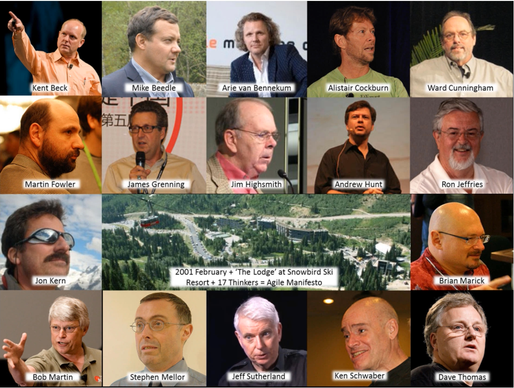
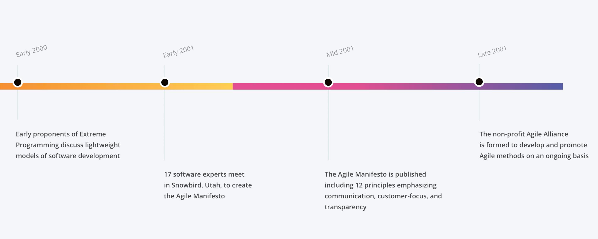
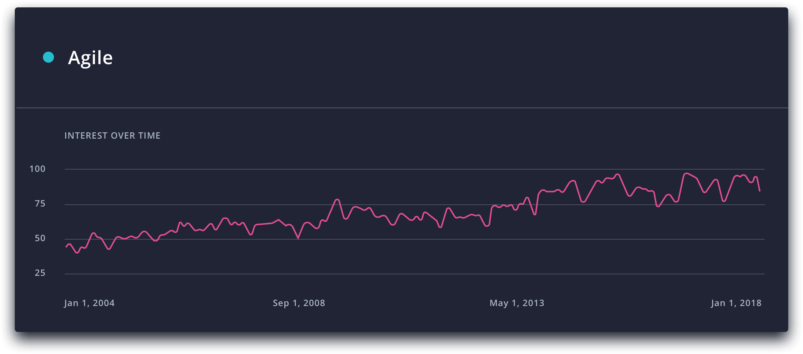
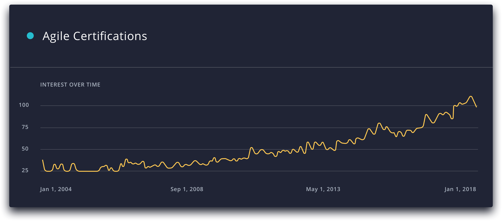

# How Agile was born

In 2001, a group of software developers gathered in the picturesque ski resort town of Snowbird, Utah, to discuss emerging approaches to their trade. They hit on some ideas that they felt were good enough to commit to paper. They certainly had ambitions. But they had no clue how far their words would go.

## Agile Manifesto

Their central belief was that software development needed to be more adaptive and responsive to change - or **agile** as the group decided to call it. The [Agile Manifesto](http://agilemanifesto.org/) transformed this core concept into a software industry rallying cry.

> We are uncovering better ways of developing software by doing it and helping others do it. Through this work we have come to value:
>
> **Individuals and interactions** over processes and tools
>
> **Working software over comprehensive** documentation
>
> **Customer collaboration** over contract negotiation
>
> **Responding to change** over following a plan
>
> That is, while there is value in the items on the right, we value the items on the left more.
>
> Signed by Kent Beck, Mike Beedle, Arie van Bennekum, Alistair Cockburn, Ward Cunningham, Martin Fowler, James Grenning, Jim Highsmith, Andrew Hunt, Ron Jeffries, Jon Kern, Brian Marick, Robert C. Martin, Steve Mellor, Ken Schwaber, Jeff Sutherland, Dave Thomas

This manifesto is important because gives to everybody a common ground. The Agile Manifesto is available on the [website](http://agilemanifesto.org/).

The group continued to collaborate, producing a succinct statement of supporting principles that emphasizes spontaneous collaboration, simplicity, and the pursuit of technical excellence to meet changing demands and achieve goals. With the manifesto, they created also the [Agile Principles](./principle.md) and the [Agile Alliance](https://www.agilealliance.org/).

Seventeen years later, these principles have penetrated virtually every industry and market. They are prescribed by consultancies and business schools as the antidote to a variety of enterprise ailments. And they are regularly dissected through books, management seminars, and online forums. Not bad for a project the founders intended only to galvanize the software sector - and that some were unsure would succeed even in that.

## The popularity

Google Trends data shows interest in terms like _agile_ and _agile certification_ has remained on a steady upward track worldwide since 2004. Agile has also been the focus of recent articles in publications as diverse as Forbes, CIO, Global Healthcare and Harvard Business Review exploring its applicability across functions from marketing to human resources.

> I didn't expect [the Agile Manifesto] to travel so widely within the software profession, let alone so widely outside it. Initial responses ran the gamut. Some people thought it was really good, but most of our potential clients in the software industry thought it was ridiculous
>
> Martin Fowler
> Chief Scientist, Thoughtworks

By most measures, then, the movement born in Utah all those years ago can be considered a success. But success can change ideas the same way it changes people, and in the eyes of some of its earliest proponents, agile has strayed too far from its original meaning and mission. The time has come to return to the roots of agile - and in doing so, ensure it reaches its potential in spurring the successful digital transformation of businesses for decades to come.

## The rise of fake agile

The constant and exhaustive discussion around agile has resulted in what [Fowler](https://en.wikipedia.org/wiki/Martin_Fowler_(software_engineer)) terms **semantic diffusion**: the spreading around of a term to an extent that its original definition is weakened and eventually lost.

While this can be an unpleasant process to watch for champions of a concept, in Fowler's view, it's an inevitable by-product of an idea gaining popular currency. "It’s the price of success," he said. "You only get this problem when people have realized the idea is valuable and want to take it on."

At the same time, the agile trend means more people and organizations claim to aspire to it, but "don't actually want to learn the hard part of doing it. They just want someone to wave a wand and give them the thing." These forces have given rise to versions of agile that may look and sound like the real thing, but are fake agile in much the same way fashion labels contend with fake brands. And fake agile has become, to use Fowler's words, an "industrial enterprise."

"The whole world of [the Scaled Agile Framework] and certifications, the tool vendors that basically say buy this training course and you will become agile - that's been very problematic," Fowler says. This is less to do with agile frameworks or courses being inherently flawed than with organizations deciding the course or framework is all they need to do.

