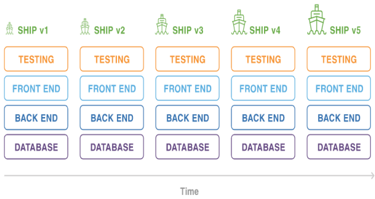

# Waterfall vs Agile

- Built in phases
- Painful to revisit previous phases
- High dependency on critical paths
- Customer can’t interact with product until it’s fully complete

|              | Waterfall | Agile |
|--------------|-----------|-------|
| Sequential   | X         |       |
| Flexible     |           | X     |
| Accommodate change |     | X     |
| Defined requirements | X |       |
| Deliver quality products | X | X |
| Continually evolving |   | X     |
| Rigid process | X        |       |

## Use Waterfall if...

- You don’t expect changes in scope and you’re working with fixed-price contracts
- The project is very simple or you’ve done it many times before
- Requirements are very well known and fixed
- Customers know exactly what they want in advance
- You’re working with orderly and predictable projects

## Use Agile if...

- The final product isn’t clearly defined
- The clients/stakeholders need the ability to modify the scope
- You anticipate any kind of changes during the project
- Rapid deployment is the goal