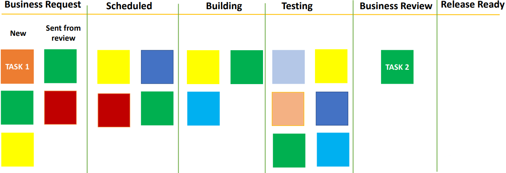

# Finding inefficiencies/issues in the process

We will start looking at some of the issues that we may find in a process when we implement [Kanban board](../kanban/kanban-board.md).

For the purpose of these cases, I'm going to use the following Kanban board.

So, the normal path of a task on this Kanban board is a new business request comes in. The develop product is tested and it is presented to the business managers. If they pass, it becomes ready for release. Then we also have a feedback. If I do business review, some changes are suggested by the business manager. The task moves back to the first step and undergoes the whole process again.

Let's see the first issue. Suppose you see a board like this for a lot of the days in a month, what does this board suggest?

This board suggests that for some reason, the flow at the testing step is not as much as it should be. The inflow is higher and the outflow is low. Now, when you are working in such a team, you would probably already have this feeling that a lot of the items are pending testing ot the testing is slow. The board calls it out clearly that the flow could be improved greatly if we do more testing. So, this situation is called having too much **WIP** (work in progress). In this situation, there is no point in doing more development or building as it is going to get stuck at the staging stage.

So, a clear suggestion is that more members need to work on the testing stage instead of any of the previous stages. When the team adjust to accommodate, this task will start to clear up from the column. In a way, the board is helping the team to identify which task should be picked up. 

You can also think about it and compare the situation for a non Agile team. A team member who works as a developer will keep on picking the development task but a lot of these tasks may take a very long time to reach the final release stage. However, in Agile team using Kanban, the team knows where to employ more resources to achieve better flow.

Now, there is a common practice which ensures that action is being taken before any steps gets cluttered. It is known as **limiting WIP**.

In this limiting WIP practice, we set a limit on the maximum number of cars that can be present in that column or that step at a time. If that limit is reached, the team will ensure that there is no further inflow into the step until the pending task in the step are cleared. For example, I put a limit of 6 tasks on the step of testing. Now, suppose 6 task on the step of testing, we will stop all the development until the time some of the tasks are cleared from the step. That ensures that this step is not cluttered and the testing team is not overburdened.

In this way, WIP limits can be set on all the steps. While it is not necessary to set it on all steps, your team should set these limits on all steps.

How do we decide what limits to set? Teams have to sit together, discuss and come up with the number. Then, slowly you can evolve it and improve it based on the experience and measurement of workflow.

>[!NOTE]
> - A limit is set on the maximum number of tasks that can be present in a column or that step at a time 
> - No further inflow into the step until the pending tasks in that step are cleared
> - WIP limits can be set on all the steps

| No. | Situation                                                               | Suggestion
|-----|-------------------------------------------------------------------------|----------------------------------|
| 1   | Too much work in progress (WIP) on a single stage - **Limiting the WIP** | More team members need to work on that stage(for e.g. testing stage in this scenario) instead of any of the previous stage |